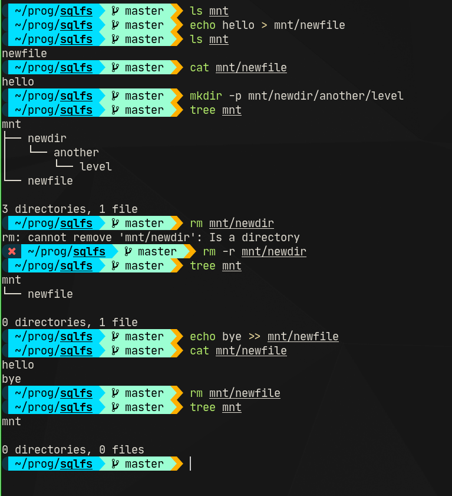

# `sqlfs`
A fuse filesystem that stores data on an sqlite db.

## How to run
```sh
go build
mkdir mnt
./sqlfs fs.sql mnt

# ... after you're done, ^C and run:
umount mnt
```

## Operations supported


## TODO
- symlinks
- `.`, `..` in directory listing (`cd ..` works but `.`, `..` aren't shown in `ls -a`)
- support for other sql backends (e.g. mysql, postgres)

## Why?
Why not? 🙃

## Note
I'm new with golang and fuse and this is my first big-ish project in this language. The code might have bugs and definitely has performance issues (e.g. [loading the entire file into memory during read](https://github.com/yoogottamk/sqlfs/blob/51f11243ba9bc02af95bf92438852385d262325f/sqlutils/common.go#L161-L163)). There was one time in early development when I called [`InvalidateEntry`](https://pkg.go.dev/bazil.org/fuse@v0.0.0-20200524192727-fb710f7dfd05#Conn.InvalidateEntry) with some arguments and had to reboot my laptop in order to get it to work again (no such inconvenience was experienced after that).

Don't use it for critical applications.

# References
- https://pkg.go.dev/bazil.org/fuse/fs
- [bazil/zipfs](https://github.com/bazil/zipfs)
- [Writing a file system in Go](https://bazil.org/talks/2013-06-10-la-gophers/#1)
